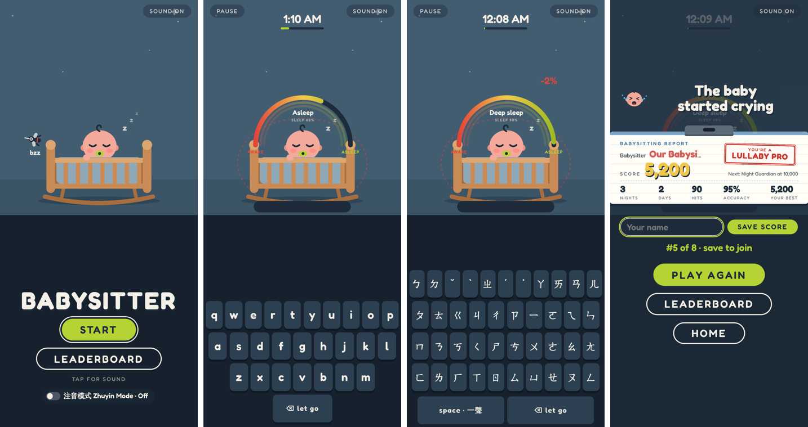

# Babysitter — Phone Version

Based on **Babysitter** (web): [github.com/yche1364-YJ/game-babysitter](https://github.com/yche1364-YJ/game-babysitter)

**Play on your phone:** [yche1364-yj.github.io/game-babysitter-mobile](https://yche1364-yj.github.io/game-babysitter-mobile/)  
**Play on itch.io:** [https://yjcgame.itch.io/babysitter-mobile](https://yjcgame.itch.io/babysitter-mobile)

## What's different on a phone

* **Portrait layout.** The scene is cropped around the crib, with a keyboard underneath.
* **The game's own keyboard.** The phone's keyboard never pops up, so it can't cover the baby or autocorrect your words.
* **Key hints.** Once you lock on to a pest, its next letter lights up green. Before that, the first letters of the pests on screen glow softly.
* **"Let go" key.** Drops the pest you're locked on so you can switch to another.
* **Zhuyin mode.** The keyboard switches to the standard Zhuyin layout, with a space key for the first tone.
* **Easier pace.** Pests are about 28% slower, arrive about 35% less often, and fewer are on screen at once.
* **Bigger text.** The title, round cards, results and leaderboard are resized for a phone screen.

## How to play

Open the game on your phone and tap the keys under the scene. On a computer, the game appears in a phone-sized frame; you can click the keys or type on your keyboard.

## Publish

Upload this folder to a GitHub repo, then go to Settings → Pages → Deploy from a branch → `main`, `/ (root)`.
